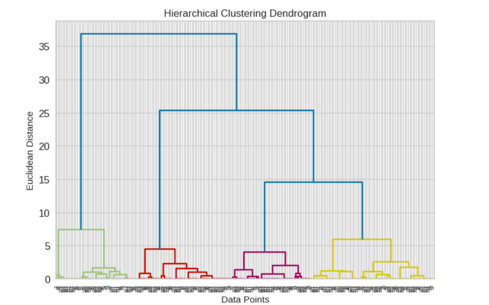
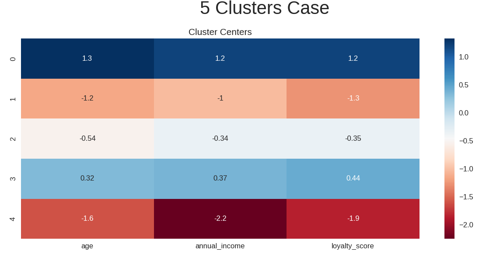

# Customer Purchasing Behavior Analysis

## 1. Project Overview
This project performs an in-depth segmentation of retail customers based on their purchasing behavior. By leveraging unsupervised machine learning techniques, the study identifies distinct customer segments (personas) to help businesses optimize marketing strategies, enhance customer retention, and increase overall profitability.

The dataset contains detailed customer profiles, including age, annual income, purchase amount, purchase frequency, and loyalty score.

## 2. Technical Highlights
* **Data Preprocessing & Dimensionality Reduction:**
    * Encoded categorical variables and applied `StandardScaler` to normalize multi-dimensional numerical features.
    * Utilized Principal Component Analysis (PCA) to reduce dimensions to 2D for effective cluster visualization.
* **Clustering Techniques:**
    * **K-Means Clustering:** Applied the Elbow Method and analyzed inertia to determine the optimal number of clusters.
    * **Hierarchical Clustering:** Implemented Agglomerative Clustering with Ward’s Linkage to minimize variance within clusters.
* **Model Evaluation:**
    * Validated cluster quality using the Silhouette Score, achieving an optimal score of 0.6366 for k=5.

## 3. Cluster Optimization & Visuals
To determine the most robust customer segments, Hierarchical Clustering with a dendrogram visualization was utilized alongside K-Means. 

*Figure 1: Hierarchical Clustering Dendrogram utilizing a color threshold to visually identify distinct segments.*

*Figure 2: Heatmap of Cluster Centers displaying the standardized mean values for age, income, and loyalty score across 5 clusters.*

## 4. Customer Personas & Business Insights
The clustering model successfully divided the customer base into 5 distinct personas:

1. **Young & Budget-Conscious:** Younger demographic with lower spending and low brand loyalty.
2. **Middle-Aged Loyalists:** Middle-aged customers with average spending but high loyalty scores.
3. **Wealthy Occasional Shoppers:** High-income customers with significant spending but low loyalty.
4. **Mixed Segment A & B:** Customers exhibiting combinations of high purchase frequency with average income levels.

**Predictive Capability:** The trained K-Means model successfully predicts segments for new customers based on their profile features.

## 5. Actionable Recommendations
* **Personalized Marketing:** Tailor promotional campaigns to the specific behaviors of each persona (e.g., loyalty rewards for middle-aged loyalists, premium upsells for wealthy shoppers).
* **Retention Strategies:** Implement targeted re-engagement programs for segments with high spending but low loyalty to prevent churn.
* **Optimized Product Placement:** Utilize cross-selling tactics based on the frequency and purchase amounts associated with specific clusters.

## 6. How to Run
1. Clone this repository: `git clone <your-repo-url>`
2. Install the required dependencies: `pip install -r requirements.txt`
3. Open `Customer_Purchasing_Behaviors.ipynb` in Google Colab or Jupyter Notebook.
4. Ensure `Customer_Purchasing_Behaviors.csv` is uploaded to the working directory.
5. Run the notebook cells sequentially.

## 7. Repository Structure
* `Customer_Purchasing_Behaviors.ipynb`: The main notebook containing the data pipeline, model training, and evaluation.
* `Customer_Purchasing_Behaviors.csv`: The raw dataset used for analysis.
* `requirements.txt`: List of Python dependencies required to run the project.
* `README.md`: Project documentation.

## 🏁 8. Conclusion
This project successfully demonstrates the power of Unsupervised Learning in transforming raw retail data into actionable business intelligence. By clearly identifying customer segments, the analysis provides a data-driven framework for optimizing marketing ROI and building long-term customer value.

---
*Project conducted by: Trần Xuân Trường - Faculty of Mathematics and Computer Science, VNU-HCM University of Science.*

*Feel free to reach out via [truongxuan2834@gmail.com](mailto:truongxuan2834@gmail.com) for any discussion regarding this project.*
